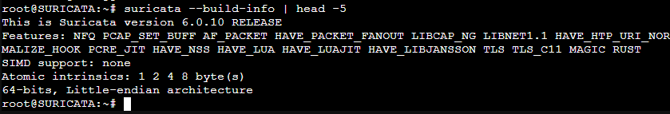
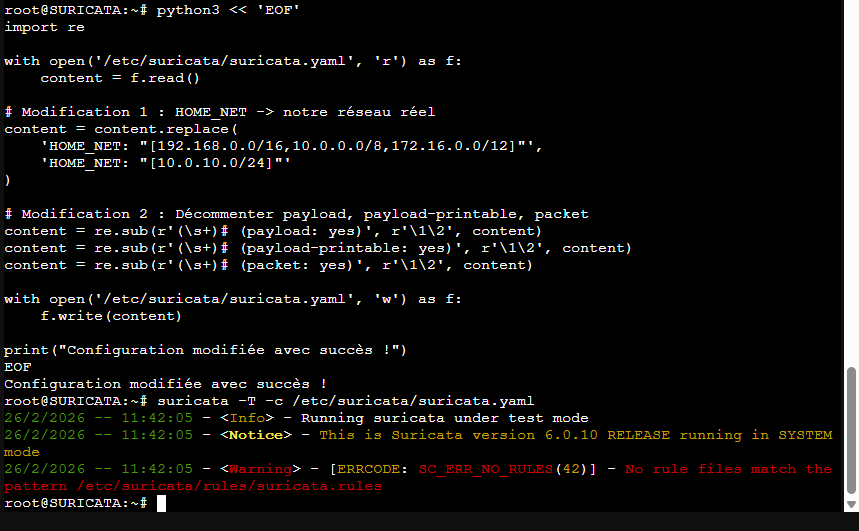
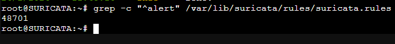
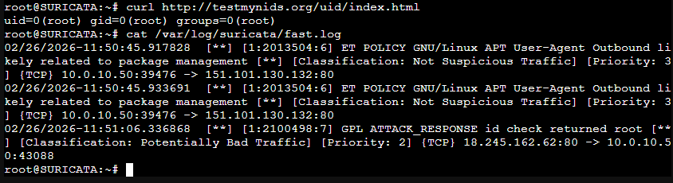
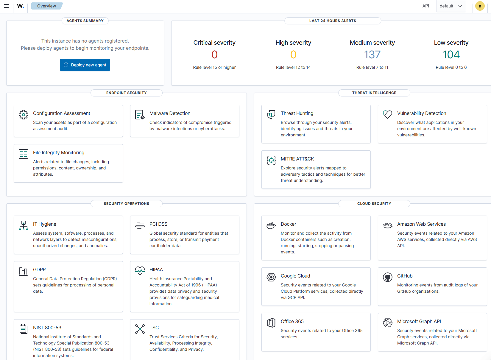
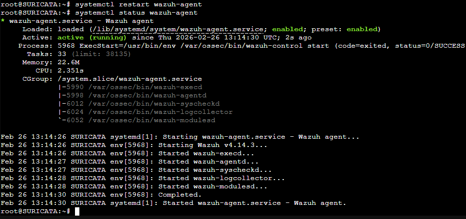
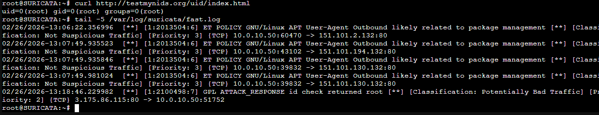

# Atelier IDS/IPS & SIEM — Suricata + Wazuh

> **Auteur :** Paul
> **Date :** 26 février 2026
> **Environnement :** Lab Proxmox — `monlab.local`
> **Durée :** Une journée

---

## Sommaire

1. [Introduction et concepts](#1-introduction-et-concepts)
2. [Architecture du lab](#2-architecture-du-lab)
3. [Prérequis](#3-prérequis)
4. [Étape 1 — Installer Suricata](#4-étape-1--installer-suricata)
5. [Étape 2 — Tester la détection](#5-étape-2--tester-la-détection)
6. [Étape 3 — Installer Wazuh](#6-étape-3--installer-wazuh)
7. [Étape 4 — Connecter Suricata à Wazuh](#7-étape-4--connecter-suricata-à-wazuh)
8. [Étape 5 — Validation bout en bout](#8-étape-5--validation-bout-en-bout)
9. [Bonus — Règle personnalisée](#9-bonus--règle-personnalisée)
10. [Corrections vs tuto original](#10-corrections-vs-tuto-original)
11. [Ce qu'on ne fait PAS en production](#11-ce-quon-ne-fait-pas-en-production)
12. [Dépannage — Problèmes rencontrés](#12-dépannage--problèmes-rencontrés)

---

## 1. Introduction et concepts

Dans cet atelier, nous mettons en place une **chaîne de détection et de supervision** complète, identique à ce qu'on trouve dans un **SOC (Security Operations Center)** en entreprise.

- **Suricata** : moteur IDS/IPS open-source qui analyse le trafic réseau en temps réel et génère des alertes selon des règles de signatures.
- **Wazuh** : SIEM open-source qui collecte les logs de multiples sources, les corrèle et les visualise dans un dashboard centralisé.

### IDS vs IPS

| Mode | Fonctionnement | Avantage | Inconvénient |
|------|---------------|----------|--------------|
| **IDS** (passif) | Écoute une copie du trafic, alerte uniquement | Aucun impact réseau | Ne bloque rien |
| **IPS** (inline) | Se place en coupure, peut bloquer | Protection active | Peut couper du trafic légitime si mal configuré |

### Pourquoi 2 machines séparées ?

| | Suricata | Wazuh |
|--|--|--|
| Rôle | Capteur réseau | Cerveau/mémoire centrale |
| Fait quoi | Analyse les paquets en temps réel | Collecte, stocke, corrèle, alerte |
| Analogie | Agent de sécurité à l'entrée | Bureau de sécurité central |

> En production, on sépare ces deux composants car Suricata doit être proche du réseau tandis que Wazuh nécessite beaucoup de ressources pour stocker et indexer des milliers d'événements.

---

## 2. Architecture du lab

```
          Internet
              │
       ┌──────┴──────┐
       │  pfSense    │
       │ 10.0.10.1   │
       └──────┬──────┘
              │
     ─── vmbr1 — LAN 10.0.10.0/24 ───────
        │           │             │
   ┌────┴────┐ ┌────┴─────┐  ┌────┴──────┐
   │  Win11  │ │ Suricata │  │   Wazuh   │
   │10.10.10.2│ │10.0.10.50│  │10.0.10.40 │
   │ (cible) │ │ (IDS/IPS)│  │  (SIEM)   │
   └─────────┘ └──────────┘  └───────────┘
```

### Tableau des machines

| Machine | Type | IP | RAM | OS | Rôle |
|---------|------|----|-----|----|------|
| pfSense | VM existante | 10.0.10.1 | 1 Go | pfSense | Firewall / Gateway |
| Win11 | VM existante | 10.10.10.2 | 4 Go | Windows 11 | VM cible |
| **Suricata** | **CT LXC** | **10.0.10.50/24** | **2 Go** | **Debian 12** | **IDS/IPS + Agent Wazuh** |
| **Wazuh** | **VM** | **10.0.10.40/24** | **8 Go** | **Debian 13 Trixie** | **SIEM complet** |

### Versions utilisées

| Logiciel | Version |
|----------|---------|
| Suricata | 6.0.10 |
| Wazuh (Manager + Agent) | 4.14.3 |
| Règles Emerging Threats | 48 703 règles |

---

## 3. Prérequis

- Serveur Proxmox fonctionnel
- VM pfSense configurée (firewall/gateway) sur `vmbr1`
- VM Windows 11 sur le LAN
- Minimum **10 Go de RAM disponible** sur Proxmox
- Accès Internet depuis les VMs
- Domaine AD : `monlab.local`

> ⚠️ **Adapter le bridge réseau** : ce lab utilise `vmbr1`. Le tuto original utilise `vmbr2` — toujours vérifier son environnement.

---

## 4. Étape 1 — Installer Suricata

### 4.1 — Créer le conteneur LXC Suricata

Dans Proxmox → **Créer CT** :

| Champ | Valeur |
|-------|--------|
| CT ID | 400 |
| Hostname | `suricata` |
| Template | `debian-12-standard` |
| Disque | 20 Go |
| CPU | 2 cœurs |
| RAM | 2048 Mo |
| Bridge | **`vmbr1`** |
| IPv4/CIDR | **`10.0.10.50/24`** |
| Passerelle | **`10.0.10.1`** |
| DNS | `10.0.10.1` (pfSense) |

> ⚠️ Bien utiliser `/24` et non `/16` — toujours adapter le masque à son réseau réel !

Vérifier la connectivité après démarrage :

```bash
ping -c 4 10.0.10.1    # Gateway pfSense
ping -c 4 8.8.8.8      # Internet
```


### 4.2 — Installer Suricata

```bash
apt update && apt upgrade -y
apt install -y suricata suricata-update
```

Vérifier l'installation :

```bash
suricata --build-info | head -5
```



### 4.3 — Configurer Suricata

> ⚠️ **Ne jamais éditer `suricata.yaml` manuellement avec nano** — le YAML est très sensible à l'indentation. Utiliser un script Python pour garantir des modifications propres.

Appliquer toutes les modifications en une seule commande :

```bash
python3 << 'EOF'
import re

with open('/etc/suricata/suricata.yaml', 'r') as f:
    content = f.read()

# 1. HOME_NET : adapter à son réseau réel
content = content.replace(
    'HOME_NET: "[192.168.0.0/16,10.0.0.0/8,172.16.0.0/12]"',
    'HOME_NET: "[10.0.10.0/24]"'
)

# 2. Corriger le chemin des règles (bug du paquet Debian)
content = content.replace(
    'default-rule-path: /etc/suricata/rules',
    'default-rule-path: /var/lib/suricata/rules'
)

# 3. Activer le payload dans les logs (lab uniquement !)
content = re.sub(r'(\s+)# (payload: yes)', r'\1\2', content)
content = re.sub(r'(\s+)# (payload-printable: yes)', r'\1\2', content)
content = re.sub(r'(\s+)# (packet: yes)', r'\1\2', content)

with open('/etc/suricata/suricata.yaml', 'w') as f:
    f.write(content)

print("Configuration modifiée avec succès !")
EOF
```

Valider la configuration :

```bash
suricata -T -c /etc/suricata/suricata.yaml
# Attendu : "Configuration provided was successfully loaded."
```



> ⚠️ **Bug connu Debian** : `suricata-update` stocke les règles dans `/var/lib/suricata/rules/` mais la config du paquet Debian pointe vers `/etc/suricata/rules/`. Le script ci-dessus corrige ce désalignement automatiquement.

### 4.4 — Télécharger les règles Emerging Threats

```bash
suricata-update
grep -c "^alert" /var/lib/suricata/rules/suricata.rules
```



### 4.5 — Démarrer Suricata

```bash
systemctl enable suricata
systemctl start suricata
tail -f /var/log/suricata/suricata.log
# Attendre : "All AFP capture threads are running."
```


---

## 5. Étape 2 — Tester la détection

### 5.1 — Déclencher la règle de test standard

```bash
apt install curl -y
curl http://testmynids.org/uid/index.html
```

> ⚠️ Utiliser `http://` et **pas** `https://` — Suricata ne déchiffre pas le trafic TLS en mode IDS standard.

Cette URL retourne volontairement `uid=0(root)` qui déclenche la règle **GPL ATTACK_RESPONSE** (SID 2100498).

### 5.2 — Vérifier les alertes

```bash
cat /var/log/suricata/fast.log
```

```bash
apt install jq -y
cat /var/log/suricata/eve.json | jq 'select(.event_type=="alert")'
```



---

## 6. Étape 3 — Installer Wazuh

### 6.1 — Créer la VM Wazuh

> ⚠️ **Wazuh nécessite une VM**, pas un CT — OpenSearch a besoin d'un accès kernel complet (`vm.max_map_count`).

| Champ | Valeur |
|-------|--------|
| VM ID | 401 |
| Nom | `wazuh` |
| ISO | `debian-13` |
| Disque | 50 Go |
| CPU | 2-4 cœurs |
| RAM | **8192 Mo minimum absolu** |
| Bridge | `vmbr1` |
| Modèle réseau | VirtIO |

Lors de l'installation Debian :
- Hostname : `wazuh` / Domaine : `monlab.local`
- Sélectionner **uniquement** : Serveur SSH + Utilitaires système
- **Pas d'interface graphique** — économise la RAM pour Wazuh

### 6.2 — Configurer le réseau

```bash
sudo su -
```

> 💡 Sur Debian 13, si aucun mot de passe root n'a été défini à l'installation, utiliser `sudo su -` avec le mot de passe utilisateur.

Supprimer la source CDROM (ajoutée automatiquement par l'installateur) :

```bash
cat > /etc/apt/sources.list << 'EOF'
deb http://deb.debian.org/debian trixie main
deb http://security.debian.org/debian-security trixie-security main
deb http://deb.debian.org/debian trixie-updates main
EOF
```

Configurer l'IP statique :

```bash
nano /etc/network/interfaces
```

```
auto lo
iface lo inet loopback

auto ens18
iface ens18 inet static
    address 10.0.10.40
    netmask 255.255.255.0
    gateway 10.0.10.1
    dns-nameservers 10.0.10.1
```

```bash
systemctl restart networking
ping -c 4 10.0.10.1 && ping -c 4 8.8.8.8 && ping -c 4 10.0.10.50
```

### 6.3 — Installer Wazuh tout-en-un

```bash
apt update && apt install curl -y
curl -sO https://packages.wazuh.com/4.14/wazuh-install.sh
bash ./wazuh-install.sh -a
```

> ⚠️ L'URL `packages.wazuh.com/4.x/` retourne "Access Denied" — utiliser la version spécifique `4.14`.
> ⚠️ L'installation prend **5 à 15 minutes** — ne pas interrompre !

À la fin, **noter impérativement** le mot de passe affiché :

```
User: admin
Password: <mot_de_passe_généré_aléatoirement>
```

Si le mot de passe est perdu :

```bash
tar -xvf ~/wazuh-install-files.tar wazuh-install-files/wazuh-passwords.txt -O | grep -A1 '"admin"'
```

### 6.4 — Vérifier les services et accéder au dashboard

```bash
systemctl status wazuh-manager wazuh-indexer wazuh-dashboard
```

Depuis Win11 : `https://10.0.10.40`

- **Login** : `admin` ⚠️ pas le nom de la machine !
- **Mot de passe** : celui noté à l'installation

> 💡 Avertissement certificat SSL auto-signé normal — cliquer **Avancé → Continuer quand même**.



---

## 7. Étape 4 — Connecter Suricata à Wazuh

### 7.1 — Installer l'agent Wazuh sur Suricata

Depuis la machine Suricata (`10.0.10.50`), exécuter **dans l'ordre** :

```bash
apt install gpg -y
```

```bash
curl -s https://packages.wazuh.com/key/GPG-KEY-WAZUH | gpg \
  --no-default-keyring \
  --keyring gnupg-ring:/usr/share/keyrings/wazuh.gpg \
  --import && chmod 644 /usr/share/keyrings/wazuh.gpg
```

```bash
echo "deb [signed-by=/usr/share/keyrings/wazuh.gpg] https://packages.wazuh.com/4.x/apt/ stable main" \
  | tee /etc/apt/sources.list.d/wazuh.list
```

```bash
apt update
```

```bash
WAZUH_MANAGER="10.0.10.40" apt install -y wazuh-agent
```

Démarrer l'agent :

```bash
systemctl daemon-reload
systemctl enable wazuh-agent
systemctl start wazuh-agent
systemctl status wazuh-agent
```



### 7.2 — Vérifier la connexion côté Manager

Depuis la VM Wazuh :

```bash
/var/ossec/bin/manage_agents -l
# Attendu : ID: 001, Name: SURICATA, IP: 10.0.10.50
```

### 7.3 — Configurer la collecte de eve.json

Sur Suricata, utiliser Python pour modifier la config de l'agent proprement :

```bash
python3 << 'EOF'
import re

with open('/var/ossec/etc/ossec.conf', 'r') as f:
    content = f.read()

# Supprimer un éventuel bloc mal placé
content = re.sub(
    r'\s*<!--\s*Collecte des alertes Suricata\s*-->.*?</localfile>',
    '',
    content,
    flags=re.DOTALL
)

# Ajouter le bloc AVANT </ossec_config>
bloc = """
  <!-- Collecte des alertes Suricata -->
  <localfile>
    <log_format>json</log_format>
    <location>/var/log/suricata/eve.json</location>
  </localfile>
"""
content = content.replace('</ossec_config>', bloc + '</ossec_config>')

with open('/var/ossec/etc/ossec.conf', 'w') as f:
    f.write(content)

print("Configuration corrigée !")
EOF
```

```bash
chmod 644 /var/log/suricata/eve.json
systemctl restart wazuh-agent
```

> ⚠️ Ne jamais modifier `ossec.conf` manuellement — une mauvaise indentation XML fait échouer le redémarrage de l'agent.

### 7.4 — Vérifier dans le Dashboard

Dashboard Wazuh → **Agents Management** → l'agent `SURICATA` doit apparaître avec le statut **Active** (point vert).


---

## 8. Étape 5 — Validation bout en bout

### 8.1 — Déclencher une alerte

Depuis Suricata :

```bash
curl http://testmynids.org/uid/index.html
tail -5 /var/log/suricata/fast.log
```

### 8.2 — Vérifier dans Wazuh Dashboard

**Explore → Discover** → filtre :

```
rule.groups: suricata
```

| Champ Wazuh | Valeur attendue |
|-------------|-----------------|
| `agent.name` | SURICATA |
| `agent.ip` | 10.0.10.50 |
| `data.alert.signature_id` | 2100498 |
| `data.payload_printable` | uid=0(root)... |



**Chaîne complète validée :**

```
curl testmynids.org
    → Suricata détecte (SID 2100498)
        → eve.json
            → Agent Wazuh
                → Manager Wazuh
                    → Indexer
                        → Dashboard ✅
```

---

## 9. Bonus — Règle personnalisée

### 9.1 — Créer la règle

Sur Suricata :

```bash
nano /var/lib/suricata/rules/local.rules
```

```
alert http any any -> any any (msg:"CUSTOM - Mot secret detecte dans le trafic HTTP"; flow:established,to_server; content:"SuperSecret2025"; nocase; sid:1000001; rev:1; classtype:policy-violation;)
```

| Élément | Signification |
|---------|--------------|
| `alert http` | Surveiller le trafic HTTP |
| `content:"SuperSecret2025"` | Chercher ce mot-clé dans le paquet |
| `nocase` | Insensible à la casse |
| `flow:established,to_server` | Connexion TCP établie, direction client→serveur |
| `sid:1000001` | Les règles custom commencent à 1000001 |

### 9.2 — Activer la règle

```bash
python3 << 'EOF'
with open('/etc/suricata/suricata.yaml', 'r') as f:
    content = f.read()

content = content.replace(
    'rule-files:\n  - suricata.rules',
    'rule-files:\n  - suricata.rules\n  - local.rules'
)

with open('/etc/suricata/suricata.yaml', 'w') as f:
    f.write(content)

print("Règle locale ajoutée !")
EOF

systemctl restart suricata
tail -5 /var/log/suricata/suricata.log
# Attendu : "2 rule files processed. 48703 rules successfully loaded"
```

### 9.3 — Tester la règle

> ⚠️ **Correction importante vs tuto original** : `flow:established,to_server` nécessite une vraie connexion TCP établie. Un `curl` vers une IP sans serveur HTTP ne fonctionnera pas (connexion refusée = RST = règle ne se déclenche pas).

**Solution** : démarrer un serveur HTTP temporaire sur Suricata :

```bash
python3 -m http.server 8080 &
```

Puis depuis Win11 (navigateur) :

```
http://10.0.10.50:8080/SuperSecret2025
```

Vérifier l'alerte sur Suricata :

```bash
cat /var/log/suricata/eve.json | jq 'select(.alert.signature_id==1000001)'
```

### 9.4 — Vérifier dans Wazuh

**Explore → Discover** → filtre :

```
data.alert.signature_id: 1000001
```


---

## 10. Corrections vs tuto original

| # | Problème dans le tuto | Correction appliquée |
|---|-----------------------|---------------------|
| 1 | Bridge `vmbr2` | Adapter → **`vmbr1`** selon son environnement |
| 2 | Réseau `10.0.0.0/16` | Adapter → **`10.0.10.0/24`** (réseau réel) |
| 3 | DNS `8.8.8.8` | En AD, utiliser **pfSense/DC** comme DNS |
| 4 | Édition manuelle `suricata.yaml` avec nano | Utiliser **scripts Python** — nano casse le YAML |
| 5 | Chemin règles `/etc/suricata/rules/` | Corriger → **`/var/lib/suricata/rules/`** (bug paquet Debian) |
| 6 | URL Wazuh `packages.wazuh.com/4.x/` | Utiliser version spécifique → **`4.14`** |
| 7 | `su -` puis `sudo bash` | Redondant — si déjà root, `bash` suffit |
| 8 | Test règle custom avec `curl` seul | Nécessite un **serveur HTTP** → `python3 -m http.server 8080` |
| 9 | Sources CDROM dans `sources.list` Debian | Remplacer par **dépôts réseau officiels** |
| 10 | Template `debian-13` CT | Préférer **`debian-12`** (LTS stable) en production |

---

## 11. Ce qu'on ne fait PAS en production

### Payload logging permanent
```yaml
# ⚠️ LAB UNIQUEMENT — contient données sensibles (mots de passe, PII)
payload: yes
payload-printable: yes
```
En production : activer uniquement lors d'investigations ciblées et temporaires.

### Certificat SSL auto-signé
En production : PKI interne d'entreprise ou Let's Encrypt. Jamais d'auto-signé sur un outil de sécurité.

### DNS public (8.8.8.8)
En entreprise : DNS internes obligatoires. Les requêtes DNS ne doivent pas fuiter vers l'extérieur.

### Installation Wazuh tout-en-un (`-a`)
En production : architecture distribuée — Manager, Indexer et Dashboard sur 3 machines distinctes pour la performance et la haute disponibilité.

### Suricata ne voit que son propre trafic
Dans cette config, Suricata ne voit que le trafic à destination/provenance de sa propre IP. Pour surveiller tout le LAN :
- **Port mirroring (SPAN)** sur un switch manageable
- **Suricata directement sur pfSense/OPNsense**

### Pas de log rotation
Le fichier `eve.json` peut grossir de plusieurs Go par jour. Configurer `logrotate` en production.

### Pas de firewall sur la VM Wazuh
En production : bloquer le port 9200 (OpenSearch) depuis l'extérieur. N'autoriser que les agents (1514/1515) et le dashboard (443).

### Connexion directe en root
En production : utilisateur dédié avec `sudo`. SSH root désactivé (`PermitRootLogin no`).

---

## 12. Dépannage — Problèmes rencontrés

### Suricata — Configuration YAML corrompue
**Symptôme** : `Failed to parse configuration file at line 0`
**Cause** : Édition manuelle avec nano, caractère invalide introduit
**Solution** :
```bash
apt purge suricata -y && apt install suricata suricata-update -y
# Puis appliquer les modifications via script Python (voir étape 4.3)
```

### Suricata — Aucune règle chargée
**Symptôme** : `No rule files match the pattern /etc/suricata/rules/suricata.rules`
**Cause** : `suricata-update` stocke dans `/var/lib/suricata/rules/` mais la config pointe vers `/etc/suricata/rules/`
**Solution** : Corriger `default-rule-path` dans `suricata.yaml` via le script Python

### Debian — Source CDROM bloque apt
**Symptôme** : `apt update` échoue, cherche le DVD
**Solution** :
```bash
cat > /etc/apt/sources.list << 'EOF'
deb http://deb.debian.org/debian trixie main
deb http://security.debian.org/debian-security trixie-security main
deb http://deb.debian.org/debian trixie-updates main
EOF
```

### Wazuh — URL d'installation retourne du XML
**Symptôme** : `./wazuh-install.sh: ligne 1: erreur de syntaxe... '<?xml'`
**Cause** : L'URL `4.x` retourne "Access Denied"
**Solution** : `curl -sO https://packages.wazuh.com/4.14/wazuh-install.sh`

### Agent Wazuh — Localfile mal placé dans ossec.conf
**Symptôme** : `Job for wazuh-agent.service failed`
**Cause** : Bloc `<localfile>` ajouté **après** `</ossec_config>` au lieu d'avant
**Solution** : Utiliser le script Python de l'étape 7.3

### Wazuh Dashboard — Connexion impossible
**Symptôme** : "Invalid username or password"
**Cause fréquente 1** : Login `wazuh` au lieu de **`admin`**
**Cause fréquente 2** : Mot de passe perdu
**Solution** :
```bash
tar -xvf ~/wazuh-install-files.tar wazuh-install-files/wazuh-passwords.txt -O | grep -A1 '"admin"'
```

### Règle custom — Ne se déclenche pas
**Symptôme** : Pas d'alerte SID 1000001 avec `curl http://10.0.10.50/...`
**Cause** : `flow:established,to_server` nécessite une connexion TCP établie — sans serveur HTTP, le client reçoit RST
**Solution** :
```bash
python3 -m http.server 8080 &
# Puis accéder depuis Win11 : http://10.0.10.50:8080/SuperSecret2025
```

---

## Conclusion

Cet atelier permet de mettre en place une **mini-infrastructure SOC** complète et fonctionnelle.

### Résultats obtenus

| Objectif | Statut |
|----------|--------|
| Suricata installé et configuré en mode IDS | ✅ |
| 48 703 règles Emerging Threats chargées | ✅ |
| Wazuh déployé (Manager + Indexer + Dashboard) | ✅ |
| Agent Wazuh connecté sur Suricata | ✅ |
| Collecte eve.json opérationnelle | ✅ |
| Alerte SID 2100498 visible dans Wazuh | ✅ |
| Règle custom SID 1000001 créée et corrélée | ✅ |

### Ce que cette infrastructure peut détecter

| Type d'attaque | Détecté par |
|----------------|-------------|
| Scan de ports (nmap) | Suricata → Wazuh |
| Malware connu (signatures réseau) | Suricata → Wazuh |
| Connexion vers C2 (IP malveillante connue) | Suricata → Wazuh |
| Brute force SSH | Wazuh (auth.log) |
| Mots-clés suspects dans le trafic HTTP | Règle custom → Wazuh |
| Modifications fichiers système | Wazuh (syscheckd) |

### Pour aller plus loin

- Installer l'agent Wazuh sur Win11 pour les logs Windows/AD
- Configurer le port mirroring sur pfSense pour que Suricata voie tout le trafic LAN
- Passer Suricata en mode IPS (blocage actif via NFQ)
- Créer des alertes email/Slack dans Wazuh
- Explorer le mapping MITRE ATT&CK dans le dashboard Wazuh
- Mettre en place un tableau de bord personnalisé dans Wazuh

---

*Compte rendu rédigé à l'issue de l'atelier du 26 février 2026 — Environnement lab Proxmox `monlab.local`*
