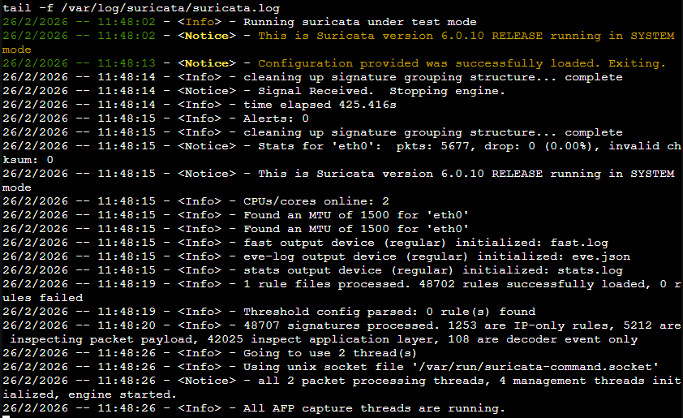
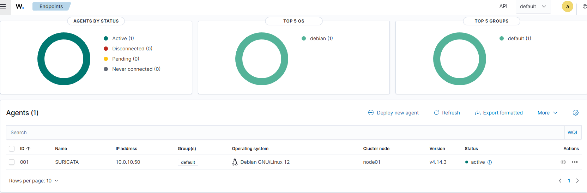
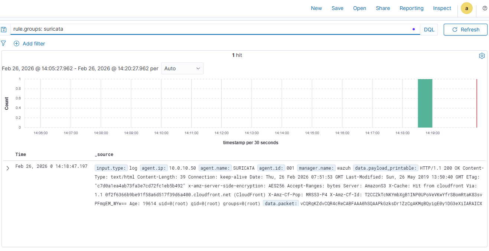

# 🛡️ Lab IDS/IPS & SIEM — Suricata + Wazuh


> Mise en place d'une chaîne de détection complète de type SOC sur infrastructure Proxmox.
> **Suricata** (IDS/IPS) + **Wazuh** (SIEM) — détection, collecte et corrélation des alertes réseau.

---

## 📋 Description

Ce projet documente l'installation et la configuration d'une **mini-infrastructure SOC (Security Operations Center)** en lab Proxmox.

L'objectif : détecter des menaces réseau avec Suricata, les centraliser dans Wazuh et les visualiser dans un dashboard SIEM — exactement comme en entreprise.

---

## 🏗️ Architecture

```
          Internet
              │
       ┌──────┴──────┐
       │  pfSense    │
       │ 10.0.10.1   │
       └──────┬──────┘
              │
     ─── vmbr1 — LAN 10.0.10.0/24 ───────
        │           │             │
   ┌────┴────┐ ┌────┴─────┐  ┌────┴──────┐
   │  Win11  │ │ Suricata │  │   Wazuh   │
   │(cible)  │ │10.0.10.50│  │10.0.10.40 │
   │         │ │ IDS/IPS  │  │   SIEM    │
   └─────────┘ └──────────┘  └───────────┘
```

| Machine | Rôle | IP | OS |
|---------|------|----|----|
| pfSense | Firewall / Gateway | 10.0.10.1 | pfSense |
| Win11 | VM cible | 10.10.10.2 | Windows 11 |
| **Suricata** | **IDS/IPS + Agent Wazuh** | **10.0.10.50** | **Debian 12 (CT LXC)** |
| **Wazuh** | **SIEM complet** | **10.0.10.40** | **Debian 13 (VM)** |

---

## ✅ Ce qui a été réalisé

- [x] Conteneur LXC Suricata avec **48 703 règles** Emerging Threats
- [x] Détection de trafic réseau suspect en temps réel
- [x] Installation Wazuh tout-en-un (Manager + Indexer + Dashboard)
- [x] Agent Wazuh connecté à Suricata — collecte du fichier `eve.json`
- [x] Alerte **SID 2100498** (GPL ATTACK_RESPONSE) visible dans Wazuh
- [x] **Règle custom SID 1000001** créée et corrélée dans le SIEM
- [x] Chaîne complète validée : `Trafic → Suricata → eve.json → Wazuh → Dashboard`

---

## 📁 Contenu du repo

```
📄 IDS-IPS-SIEM-Suricata-Wazuh.md   ← Guide complet d'installation
📁 images/                           ← Screenshots de toutes les étapes
```

---

## 📖 Guide complet

➡️ **[Lire le guide d'installation complet](./IDS-IPS-SIEM-Suricata-Wazuh.md)**

Le guide contient :
- Toutes les commandes étape par étape
- Les corrections vs le tuto original
- Les problèmes rencontrés et leurs solutions
- Les bonnes pratiques production vs lab

---

## 🔍 Aperçu des résultats

### Suricata opérationnel



### Agent Wazuh connecté



### Alerte détectée dans le SIEM



---

## 🛠️ Stack technique

| Outil | Version | Rôle |
|-------|---------|------|
| Proxmox VE | Lab | Hyperviseur |
| pfSense | - | Firewall / NAT |
| Suricata | 6.0.10 | Moteur IDS/IPS |
| Emerging Threats | 48 703 règles | Signatures de détection |
| Wazuh | 4.14.3 | SIEM (Manager + Indexer + Dashboard) |
| Debian | 12 / 13 | OS des VMs |

---

## 📝 Points clés appris

- Différence IDS (passif) vs IPS (actif inline)
- Architecture SOC : capteur réseau → SIEM → dashboard
- Configuration `suricata.yaml` et règles Emerging Threats
- Intégration Suricata → Wazuh via le format EVE JSON
- Création de règles Suricata personnalisées (SID custom)
- Limites d'un lab vs production (payload logging, certificats, architecture distribuée)

---

*Atelier réalisé le 26 février 2026 — Environnement lab Proxmox `monlab.local`*
